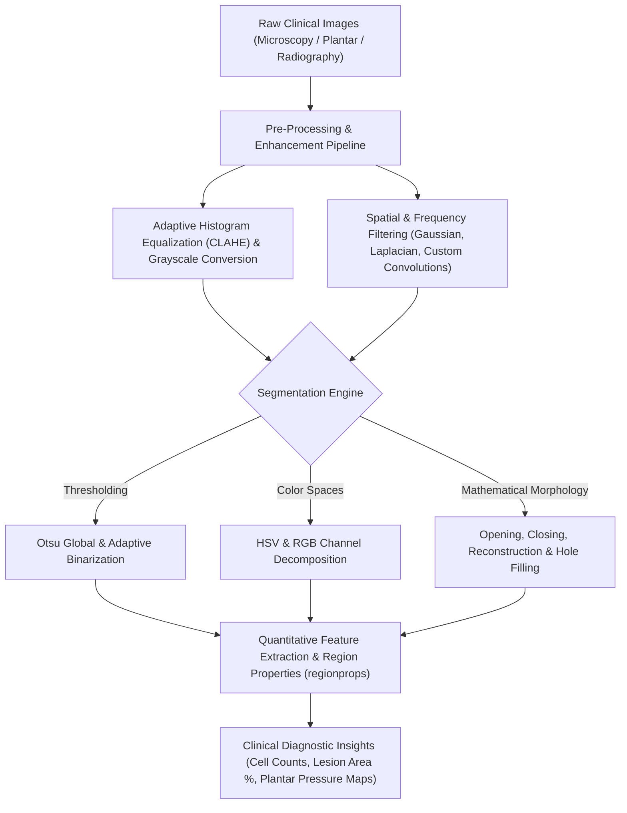

# 🔬 Medical Image Processing Suite
### Comprehensive Medical Image Processing and Computer-Aided Diagnostic (CAD) Segmentation Suite

[](https://www.mathworks.com/)
[](https://www.mathworks.com/products/image.html)
[](https://en.wikipedia.org/wiki/Digital_image_processing)
[](https://opensource.org/licenses/MIT)

---

## 📌 Overview

**Medical Image Processing Suite** is a modular computational library developed in **MATLAB** for biomedical image enhancement, morphological feature extraction, and automated anatomical/pathological segmentation. 

The suite implements clinical computer-aided diagnostics (CAD) workflows ranging from **cellular counting and oncology lesion boundary extraction** to **plantar pressure distribution profiling (orthopedic footprint assessment)** and multi-spectral color channel filtering.



---

## 🚀 Key Features

- **Contrast Enhancement & Spatial Filtering**:
  - Contrast-Limited Adaptive Histogram Equalization (CLAHE) for deep tissue feature recovery.
  - Multi-directional spatial convolution filters: Gaussian blur, Laplacian edge detection, and custom spatial mask kernels (`Maskernels.m`, `Kernel1.m`).
  - Color model transformations (RGB to HSV, Lab, YCbCr) for chrominance-based tissue segmentation.
- **Advanced Segmentation Techniques**:
  - Global Otsu thresholding, multi-level thresholding, and adaptive binarization.
  - Color-guided segmentation for isolated biological dyes (Rojo, Verde, Azul, Flores).
- **Mathematical Morphology**:
  - Structural element operations (erosion, dilation, opening, closing).
  - Geodesic morphological reconstruction for cell separation and artifact suppression.
- **Clinical Case Applications**:
  - **Plantar Pressure Footprint Analyzer (`plantar_pressure_analyzer.m`)**: Orthopedic footprint arch and pressure distribution calculation.
  - **Cellular & Tissue Pathology Counting (`Celulas.m`, `Cancer.m`)**: Microscopic blob detection, boundary tracing, and area quantification.

---

## 🛠️ Technology Stack

| Domain | Technologies |
|---|---|
| **Core Platform** | MATLAB (R2021a - R2024b) |
| **Toolboxes** | Image Processing Toolbox, Computer Vision Toolbox |
| **Techniques** | Mathematical Morphology, CLAHE, Spatial Convolutions, Otsu Thresholding |

---

## 📂 Repository Structure

```
medical-image-processing-suite/
├── src/
│   ├── segmentation/               # Segmentation algorithms
│   │   ├── Binarizacion.m          # Adaptive and global thresholding
│   │   ├── Segmentacion.m          # Color thresholding
│   │   ├── Segmentacion_3.m
│   │   ├── Segmentacion_Azul.m     # Blue chrominance filter
│   │   ├── Segmentacion_Rojo.m     # Red dye isolation
│   │   └── Segmentacion_Verde.m
│   ├── enhancement_filters/        # Enhancement and convolution kernels
│   │   ├── Ecualizada.m            # Histogram equalization & CLAHE
│   │   ├── Gaussiano.m             # Gaussian spatial smoothing
│   │   ├── Laplaceano.m            # 2nd derivative edge detection
│   │   ├── HSV.m                   # HSV color space transformations
│   │   ├── Kernel1.m
│   │   └── Maskernels.m
│   ├── morphological_analysis/     # Morphological filters and cell counting
│   │   ├── Morfologicas.m          # Structural element opening/closing
│   │   ├── Celulas.m               # Cell colony counting
│   │   └── Cancer.m                # Tissue lesion boundary detection
│   └── clinical_applications/      # Specialized diagnostics
│       ├── plantar_pressure_analyzer.m # Orthopedic footprint pressure engine
│       ├── comprehensive_exam_pipeline.m
│       └── tissue_analysis_p1.m
├── docs/                           # Laboratory reports and sample datasets
├── .gitignore
├── LICENSE
└── README.md
```

---

## ⚙️ Running in MATLAB

1. Open MATLAB.
2. Add the repository directory to your MATLAB path:
   ```matlab
   addpath(genpath(pwd));
   ```
3. Run any specific application script, for example:
   ```matlab
   % Plantar footprint analyzer
   run('src/clinical_applications/plantar_pressure_analyzer.m');

   % Cell segmentation and counting
   run('src/morphological_analysis/Celulas.m');
   ```

---

## 👤 Author

**Juan Garzón**  
*Biomedical & Computer Vision Engineer*  
- GitHub: [@JuanGarzon](https://github.com/JuanGarzon)

---

## 📄 License

This project is licensed under the MIT License - see the [LICENSE](LICENSE) file for details.
